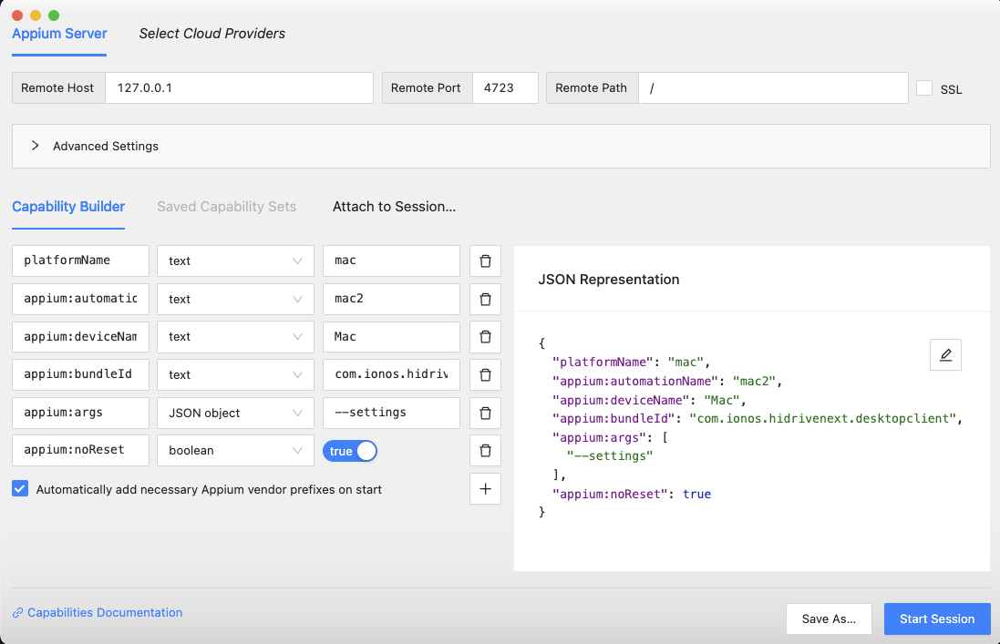
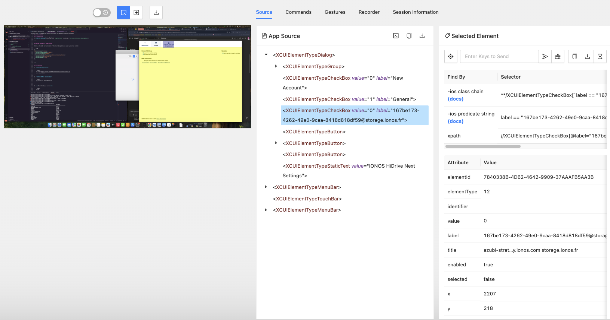
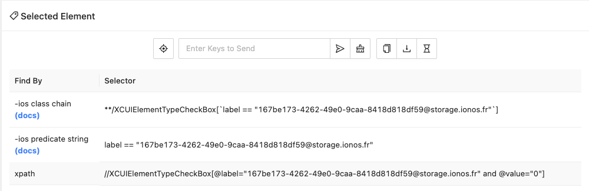

# nc-macos-tests

Automated Appium UI tests for the HiDrive Next macOS application using Python.

---

## Overview

This repository contains a demo test script (`test_appium_hidrivenext.py`) that verifies the basic functionality of the HiDrive Next desktop client on macOS via Appium.

The test:

1. Launches the HiDrive Next app.
2. Locates and clicks a target checkbox using its XPath.

---

## Prerequisites

Before running the tests, ensure you have the following installed on your system:

* **macOS 12.0+**
* **Homebrew** ([https://brew.sh](https://brew.sh))
* **Appium Server** v2.x (installed via `npm install -g appium`)
* **Appium Inspector** (for obtaining UI element locators)
* **Python 3.8+**
* **pip** (Python package manager)
* **Java JDK 8+** (required by Appium)
* **HiDrive Next App** installed under `/Applications` (bundle ID: `com.ionos.hidrivenext.desktopclient`)

---


## Installation

1. **Clone the repository**

   ```bash
   git clone https://github.com/IONOS-Productivity/nc-macos-tests.git
   cd nc-macos-tests
   ```

2. **Install Python dependencies**

   ```bash
   pip install -r requirements.txt
   ```


3. \*\*Start the Appium server \*\*

   ```bash
   appium
   ```

---

## Execution

Run the demo test script with:

```bash
python test_appium_hidrivenext.py
```

The script will:

* Launch the HiDrive Next application
* Connect via Appium
* Click the checkbox located by the provided XPath
* Exit without errors

---

## Acceptance Criteria

* `test_appium_hidrivenext.py` successfully launches HiDrive Next and clicks the target checkbox via the provided XPath
* `README.md` exists at the repo root and clearly documents setup & execution steps
* The test script runs without errors (assuming the Appium server is running)
* The code contains docstrings and inline comments explaining each step
* The corresponding Jira issue key is referenced in the Git commit message or Pull Request

---


## Appium (Inspector) Capabilities

Below is the JSON representation of the desired capabilities used by the test script:

```json
{
  "platformName": "mac",
  "appium:automationName": "mac2",
  "appium:deviceName": "Mac",
  "appium:bundleId": "com.ionos.hidrivenext.desktopclient",
  "appium:args": ["--settings"],
  "appium:noReset": true
}
```

---

## Using the Appium Inspector

Leverage the **Appium Inspector** to explore the HiDrive Next UI and identify element locators (labels, XPaths, accessibility IDs):

1. **Start the Appium server** (if it isn’t already running):

   ```bash
   appium
   ```
2. **Launch the Inspector**:

   ```bash
   appium-inspector
   ```
3. **Configure the connection**:

   * In the Inspector window under **Desired Capabilities**, paste the Capabilities(JSON Representation).
   * Make sure `platformName`, `bundleId`, etc. are all correct.



4. **Start a session**:
   Click **Start Session** to have Appium launch the HiDrive Next app on your Mac.
5. **Browse the UI hierarchy**:

   * In the left-hand tree, you’ll see all UI elements.
   * Select an element to view its properties in the right-hand panel.


6. **Copy a locator**:

   * Under **Attributes**, find properties like `label`, `name`, `value`, `xpaths`, etc.
   * Right-click the desired attribute (e.g. `label` or `xpath`) and choose **Copy → Copy XPath** or **Copy Accessibility ID**.


7. **Insert the locator into your test script**:
   Paste the copied XPath or accessibility ID into your code, for example:

   ```python
   element = driver.find_element(By.XPATH, "//XCUIElementTypeButton[@label='My Label']")
   ```

These steps will help you generate reliable locators for your Appium tests.

---

## Installing Appium Inspector

Choose one of the following installation methods:

1. **Via Appium Desktop**

   * Download the latest Appium Desktop release from the [Appium Releases page](https://github.com/appium/appium-desktop/releases).
   * Open the DMG and drag **Appium Inspector** into your Applications folder.

2. **Via npm (Community Inspector)**

   ```bash
   npm install -g appium-inspector
   ```

After installation, launch the Inspector from your Applications folder or by running:


